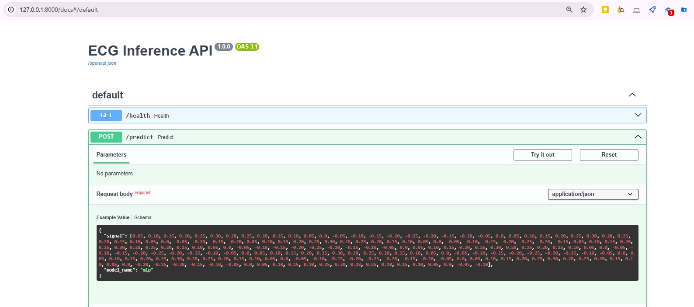
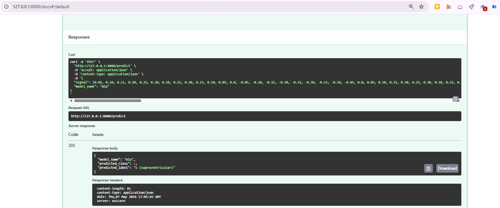
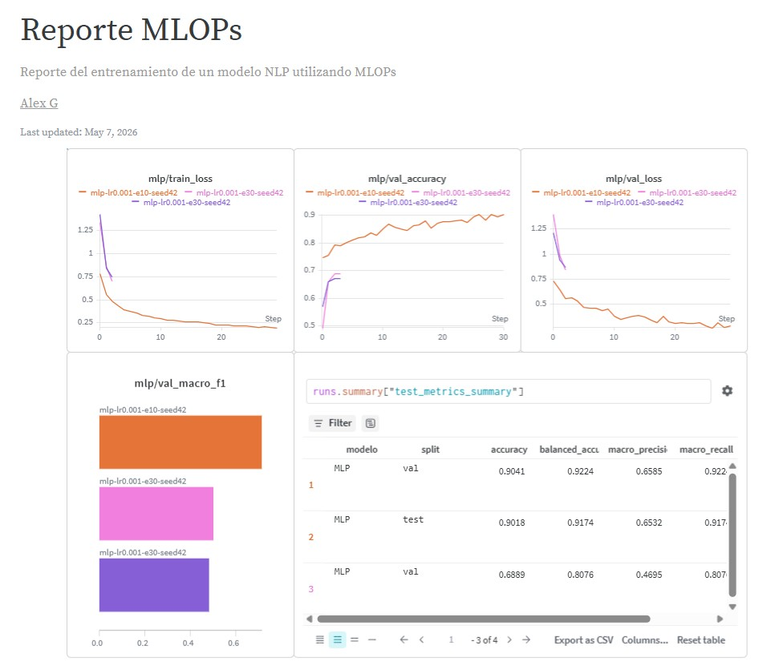
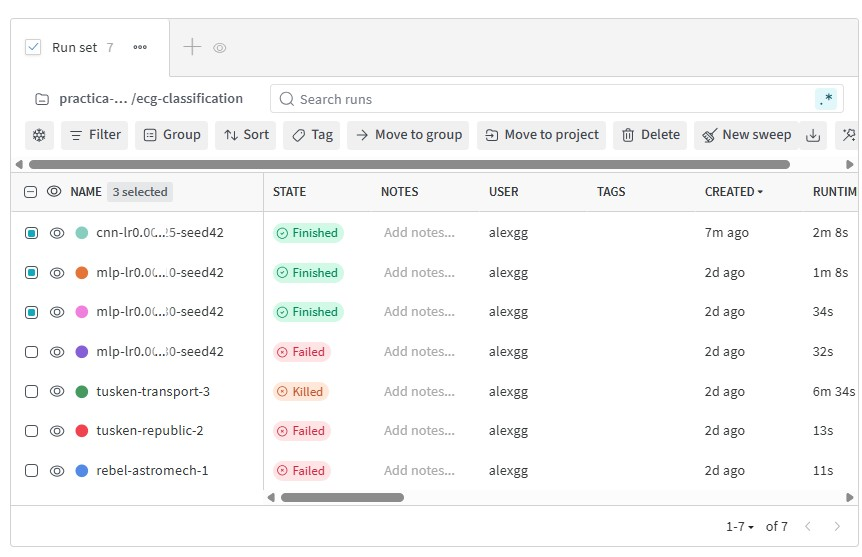

# ECG Arrhythmia Classification - Proyecto MLOps

**Autores:** Carlos Ruiz Oyarzun y Alejandro Gomez

Proyecto final de MLOps aplicado a un modelo de clasificacion de latidos ECG con el
dataset MIT-BIH. El repositorio incluye entrenamiento reproducible, tracking de
experimentos con Weights & Biases, API REST con FastAPI, tests automatizados, CI en
GitHub Actions y contenedorizacion con Docker.

## Funcionalidades principales

- Entrenamiento de varios modelos de clasificacion: baseline, regresion logistica,
  Random Forest, MLP y CNN 1D.
- Comparacion de metricas en validacion y test.
- Registro de configuracion, metricas, tablas y artefactos en W&B.
- API de inferencia con FastAPI para servir predicciones.
- Dockerfile para ejecutar el servicio de inferencia en un contenedor.
- Tests unitarios y workflow de CI/CD en GitHub Actions.

## Estructura del proyecto

```text
PruebaMLOPS/
├── config/
│   └── config.yaml              # Configuracion base de entrenamiento
├── data/
│   ├── mitbih_train.csv         # Dataset de entrenamiento
│   └── mitbih_test.csv          # Dataset de test
├── img/                         # Capturas de ejecucion, API y W&B
├── models/                      # Artefactos generados durante el entrenamiento
├── notebooks/                   # Notebooks original y resumido
├── src/
│   ├── config.py                # Constantes globales
│   ├── data.py                  # Carga y particionado de datos
│   ├── evaluation.py            # Metricas
│   ├── features.py              # Extraccion de caracteristicas
│   ├── inference_api.py         # API FastAPI
│   ├── models.py                # Modelos y entrenamiento
│   └── train.py                 # Orquestacion del experimento
├── tests/                       # Tests unitarios
├── .github/workflows/tests.yml  # CI en GitHub Actions
├── Dockerfile
├── pyproject.toml
├── uv.lock
└── README.md
```

## Clases predichas

| Clase | Descripcion |
| ----- | ----------- |
| 0 | N - latido normal |
| 1 | S - supraventricular |
| 2 | V - ventricular |
| 3 | F - fusionado |
| 4 | Q - desconocido |

## Configuracion local

El proyecto usa `uv` para crear el entorno e instalar dependencias.

```bash
# Instalar uv si no esta disponible
curl -LsSf https://astral.sh/uv/install.sh | sh

# Crear entorno e instalar dependencias de produccion y desarrollo
uv sync --extra dev
```

Los ficheros de datos deben estar en:

```text
data/mitbih_train.csv
data/mitbih_test.csv
```

Nota para la entrega por campus: si el limite de subida es de 50 MB, los CSV pueden
no ir incluidos en el ZIP compacto. En ese caso se mantiene `data/README.md` con la
indicacion de los ficheros esperados.

## Configuracion de W&B

El repositorio no incluye credenciales. Para registrar experimentos en Weights & Biases,
crea un archivo `.env` local a partir de `.env.example`:

```bash
cp .env.example .env
```

Despues edita `.env` y anade tu clave:

```text
WANDB_API_KEY=tu_api_key
```

Tambien se puede autenticar con:

```bash
wandb login
```

## Entrenamiento

Entrenamiento con la configuracion base:

```bash
python src/train.py --config config/config.yaml --wandb-project ecg-classification
```

Entrenamiento rapido para pruebas locales, sin W&B:

```bash
python src/train.py --fast-run --no-wandb
```

Artefactos esperados en `models/`:

- `random_forest_ecg.joblib`
- `mlp.keras`
- `cnn_1d.keras`
- `scaler.joblib`
- `metrics_summary.csv`

## API de inferencia

La API requiere que existan los artefactos entrenados en `models/`.

```bash
uv run uvicorn src.inference_api:app --reload
```

Documentacion interactiva:

```text
http://localhost:8000/docs
```

Health check:

```bash
curl http://localhost:8000/health
```

Ejemplo de peticion:

```bash
curl -X POST http://localhost:8000/predict \
  -H "Content-Type: application/json" \
  -d '{"signal": [0.0, 0.1, 0.2], "model_name": "random_forest"}'
```

El campo `signal` debe contener 187 valores numericos. Modelos disponibles:
`random_forest`, `mlp` y `cnn_1d`.

### Evidencias de inferencia

Peticion:

<div align="center">
  
</div>

Respuesta:

<div align="center">
  
</div>

## Experimentos en W&B

Durante el entrenamiento se registran:

- Hiperparametros y configuracion del experimento.
- Perdida y accuracy por epoca para los modelos neuronales.
- Metricas finales de validacion y test.
- Tabla comparativa de modelos.
- Artefactos de modelos entrenados.

<div align="center">
  
</div>

<div align="center">
  
</div>

Proyecto W&B:

https://api.wandb.ai/links/practica-mlops-upm/83i5bibb

## Docker

Construir la imagen:

```bash
docker build -t ecg-api .
```

Lanzar el servicio:

```bash
docker run -p 8000:8000 -v "$(pwd)/models:/app/models" ecg-api
```

La API queda disponible en:

```text
http://localhost:8000
```

## Tests

```bash
PYTHONPATH=. uv run pytest -v
```

## CI/CD

El workflow `.github/workflows/tests.yml` ejecuta los tests automaticamente en cada
push o pull request contra `main` y `develop`, usando Python 3.10, 3.11 y 3.12.

## Enlaces de entrega

- GitHub: https://github.com/CarlosRuiz4102/MLOPS
- W&B Report: https://api.wandb.ai/links/practica-mlops-upm/83i5bibb
- Endpoint del servicio: http://localhost:8000/docs
